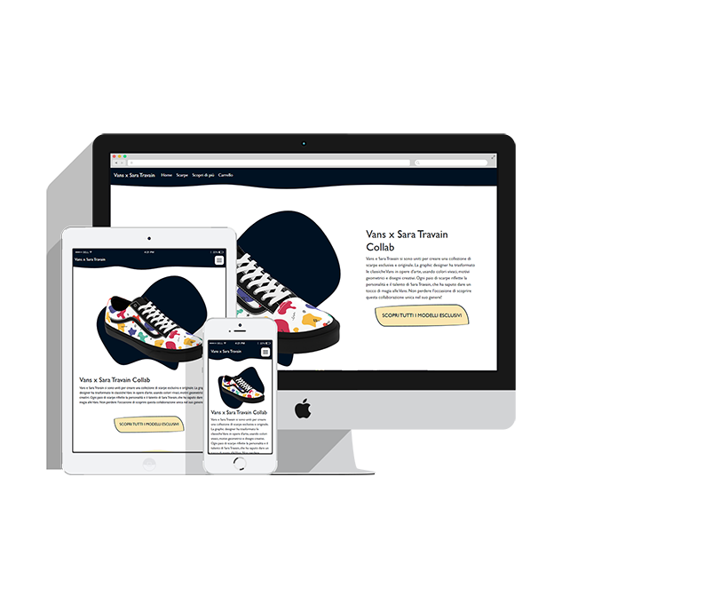
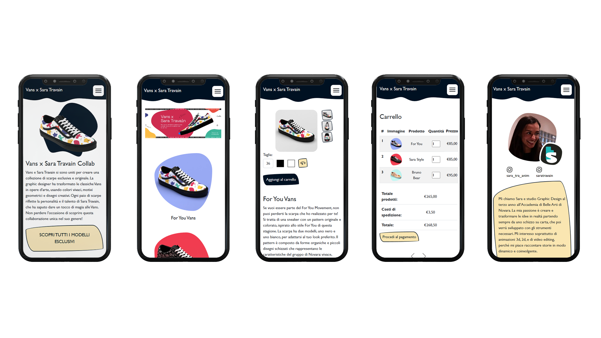
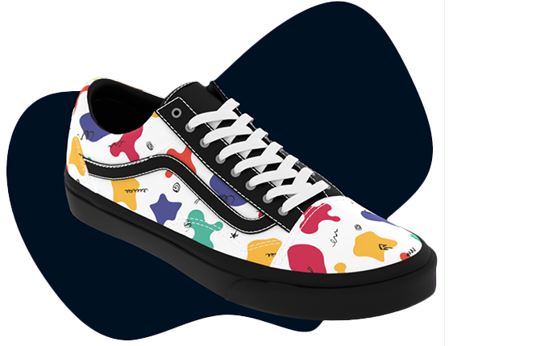
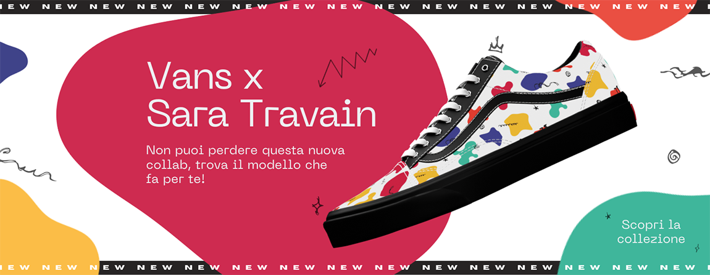
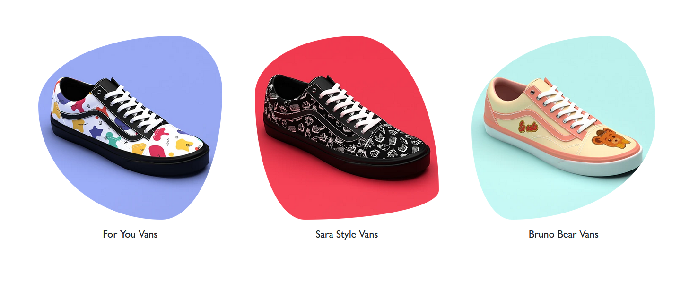
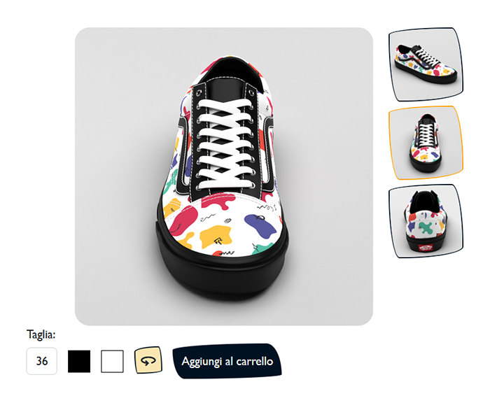
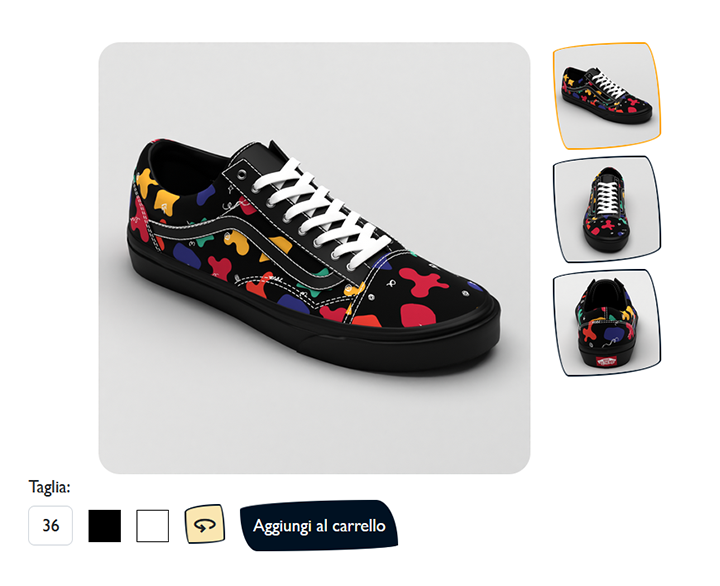
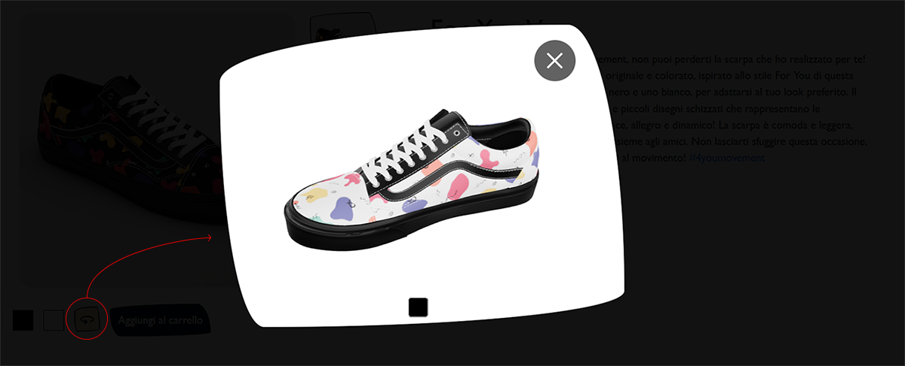

---

theme: default
_class: lead
backgroundColor: #313131
backgroundImage: url(assets/background.svg)
footer: https://github.com/saratrav/Vans-x-Sara-Travain-ecommerce
color: white
marp: true
style: |
  a {
    color: orange;
  }
  h1 {
    color: white;
  }
  pre {
  background-color: #001122b9;
  border: 3px solid #ffffff25;
    }
---

# Vans x Sara Travain

Progetto Ecommerce
<br>

**Anno accademico:** 2022/23
**Docente:** Matteo Baccan
**Corso:** Web Design 2





---

# Introduzione

Il sito viene realizzato per un'ipotetica collaboazione tra Vans e me, in cui ci sono le scarpe con le mie grafiche. Questo progetto è stato realizzato per il corso di Web Design 2 all'Accademia di Belle Arti di Novara nel 2023.

link: [https://vansxsaratravain.netlify.app](https://vansxsaratravain.netlify.app/)


---
# Strumenti utilizzati

---
## Visual Studio Code (VSCode)

Ho utilizzato VSCode per scrivere il codice del mio sito web. Per lavorare in modo più efficiente, ho collegato la mia cartella locale al mio repository GitHub. Questo mi ha permesso di tracciare le modifiche e aggiornare automaticamente il sito web.


---
## Chat di Bing

Per lo sviluppo del sito, ho utilizzato Bing Chat con GPT-4 come strumento di supporto. Questo mi ha permesso di risolvere vari problemi nel codice, in particolare con JavaScript. L'intelligenza artificiale ha fornito soluzioni efficaci e in tempi veloci, facilitando il processo di sviluppo del codice.


---
## Blender
Ho utilizzato Blender, un software libero per la creazione di contenuti 3D, per creare render delle scarpe. Ho iniziato scaricando il modello 3D della scarpa dal sito di Vans. Successivamente, ho aggiunto le luci e le texture nel modello e ho creato un’animazione che mostra la scarpa che ruota a 360 gradi.


---
## Marp
Ho utilizzato Marp, uno strumento di creazione di slide in markdown, per la realizzazione delle mie slide. Lavorando con l’estensione Marp in VSCode, ho potuto visualizzare l’anteprima delle slide direttamente all’interno dell’editor.


---
## Netlify
Ho collegato il mio repository GitHub a Netlify, una piattaforma di deployment e hosting per siti web. Questo mi permette di pubblicare automaticamente il mio sito web ogni volta che aggiorno il codice nel mio repository GitHub.


---
## Librerie e documenti esterni usati

- ### [*Bootstrap:*](https://getbootstrap.com/) struttura responsive e table
- ### [*MdBootstrap:*](https://mdbootstrap.com/) gallerie immagini
- ### [*Google fonts:*](https://fonts.google.com/) icone
- ### [*Swiper:*](https://swiperjs.com/) slider
- ### [*Model-viewer:*](https://modelviewer.dev/) caricamento dei modelli 3D
- ### [*Product-viewer:*](https://drive.google.com/file/d/1iPmH8uTKhZk8E-jfSmAxczgwMFMlzAC-/view?pli=1) visualizzatore della scarpa a 360 gradi

---
## Realizzazione Sito Web

---

Il sito è formato da **cinque pagine principali:**


---


---
## ***1) Home -***  Forme organiche animate


Ho utilizzato il sito [haikei app](https://haikei.app/), uno strumento online che genera forme ondulate personalizzabili, per creare 3 forme organiche e le ho inserite nell'html come svg. Usando il tag *<animate>* all'interno del *<svg>*, ho creato un'animazione, in cui le 3 forme si trasformano l’una nell’altra, creando un effetto di morphing.





---

## ***1) Home -*** 360° view: Sequenza di immagini interattive

[360 degree product viewer](https://drive.google.com/file/d/1iPmH8uTKhZk8E-jfSmAxczgwMFMlzAC-/view?pli=1) è un plugin jQuery che permette di creare una visualizzazione interattiva della scarpa a 360 gradi. Per ottenere questo effetto, ho realizzato una sequenza di 36 immagini della scarpa da diverse angolazioni. Quando l’utente clicca e trascina con il mouse sulla scarpa, le immagini si alternano creando l’illusione del movimento.


---

## Header e Footer

Ho sfruttato le potenzialità di [haikei app](https://haikei.app/) per creare delle strisce colorate, che ho inserito nell’header e nel footer del sito. Queste forme creano un contrasto con il resto della pagina, attirando l’attenzione del visitatore.

---

## ***2) Scarpe -*** Slider

Ho usato [swiper](https://swiperjs.com/demos), una libreria JavaScript che offre diversi demo di slider animati e personalizzabili. Ho optato per un demo in modalità Autoplay, che fa scorrere le immagini automaticamente senza bisogno di cliccare. Ogni immagine è un link che rimanda alla pagina del prodotto corrispondente.


---


---

## ***2) Scarpe -*** Griglia Prodotti

Per creare una griglia di prodotti che si adatta alle diverse dimensioni dello schermo, ho utilizzato [Bootstrap](https://getbootstrap.com/), un framework CSS che offre componenti predefiniti e personalizzabili. Per rendere le immagini più accattivanti, ho applicato un effetto di border radius variabile, usando lo strumento online [fancy border radius](https://9elements.github.io/fancy-border-radius/), che mi ha permesso di scegliere lo stile del bordo in base al design del sito.


---



---

# ***3) Prodotto -*** Galleria immagini

Accanto all’immagine principale della scarpa, ci sono tre immagini secondarie che mostrano la scarpa da diverse angolazioni. Quando si passa il mouse su una di queste immagini, l’immagine principale cambia e mostra la stessa angolazione dell’immagine secondaria. Per realizzare questo effetto, ho usato una funzione di JavaScript:

```js
function changeImage(smallImage) {
  var bigImage = document.querySelector('.big-image');
  bigImage.src = smallImage.src;
}
```
---




---
# ***3) Prodotto -*** Bottoni per cambio del colore


Sotto ogni prodotto, ci sono due bottoni che consentono di selezionare il colore preferito per la scarpa. Quando si clicca su un bottone, tutte le immagini della galleria si aggiornano con la versione della scarpa nel colore scelto, modificando il valore dell’attributo _src_.
```js
smallImages[0].src = 'images/scarpe_square_foryou_lato_black.png';
smallImages[1].src = 'images/scarpe_square_foryou_front_black.png';
smallImages[2].src = 'images/scarpe_square_foryou_behind_black.png';
```
---



---
# ***3) Prodotto -*** Bottone visualizzatore 360°

Cliccando sull’icona 360 si vede la scarpa in 3D, caricata usando la libreria [modelviewer.dev](https://modelviewer.dev/). Si può cambiare il colore della scarpa e dello sfondo. La pagina si oscura per mettere in risalto la scarpa, questo effeto è dato dalla creazione di un div nero trasparente.
```js
if (!overlay) {
    overlay = document.createElement('div');
   }
```
---


---

# # ***4) Carrello -*** Table e immagini

Ho sfutatto le funzionalità di [Bootstrap](https://getbootstrap.com/) per creare una table con i prodotti aggiunti al carrello. Nella parte inferiore ho aggiunto una galleria di immagini usando [MDBootstrap](https://mdbootstrap.com/docs/standard/extended/gallery/), una versione personalizzata di Bootstrap che implementa il Material Design, che si basa su principi di design minimalista, elegante e intuitivo. L’obiettivo della galleria è quello di stimolare l’utente a comprare altri prodotti correlati a quelli nel carrello.


---

# ***5) Scopri di più***


In questa pagina si può conoscermi meglio, come designer che ha creato i vari pattern per le scarpe. C'è la mia foto, il mio logo, i link ai miei due profili Instagram, una piccola descrizione su chi sono e cosa faccio. Infine, nella parte inferiore c'è una galleria a mosaico realizzata con [MDBootstrap](https://mdbootstrap.com/docs/standard/extended/gallery/), che mostra alcuni dei miei lavori.


---

# Grazie

Sara Travain
A.A 2022/2023
Web Design 2


